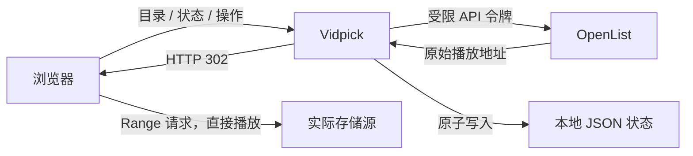

# Vidpick

一个轻量、可自托管的 OpenList 视频快刷与整理工具。它把目录中的视频随机生成播放列表，提供适合手机、平板和电脑的竖屏视频流，并支持保留、喜欢、加入待删除、导出清单和最终确认删除。

Vidpick 不转码、不代理视频内容。服务端只向 OpenList 查询文件和原始播放地址，随后用 HTTP 302 将浏览器直接跳转到存储源。这样可以保持很低的 CPU、内存和服务器带宽占用。

## 功能

- 从 OpenList 目录树选择入口目录
- 可选择是否递归扫描子目录
- 只收集视频，忽略图片和其他文件
- 每次随机生成播放顺序
- 整理模式：保留、喜欢、待删除，结束后统一复核
- 随机播放模式：持续随机播放，可收藏喜欢
- 默认预加载后续 2 个视频，改善连续滑动体验
- 递归目录采用有上限的并发扫描，并缓存最近 5 分钟的扫描结果
- 手机和平板支持上下滑动
- 电脑支持滚轮、鼠标拖动和键盘操作
- 待删除清单可导出为 CSV、TXT 或 JSON
- 删除前逐个复核路径与文件类型，再按目录调用 OpenList 删除
- 播放进度、决定和喜欢项保存在服务器，可跨设备继续
- 无数据库、无遥测、无第三方前端依赖，运行时仅使用 Node.js 内置模块

## 工作方式



浏览器的原生 `<video>` 元素负责解码和 Range 缓冲。Vidpick 不使用 FFmpeg，也不会下载、转封装或重新编码媒体。是否能播放某种封装和编码取决于浏览器与设备；例如文件扩展名是 MKV 并不代表浏览器一定支持其中的视频或音频编码。

## 操作

移动端：

- 上滑：下一个视频
- 下滑：上一个视频
- 屏幕按钮：保留、待删除、喜欢、静音、显示方式

电脑端：

| 按键 / 操作 | 作用 |
|---|---|
| `↓` / `Page Down` / 向下滚轮 | 下一个 |
| `↑` / `Page Up` / 向上滚轮 | 上一个 |
| `Space` | 播放或暂停 |
| `M` | 静音切换 |
| `K` | 保留（整理模式） |
| `D` | 加入待删除（整理模式） |
| `F` | 喜欢 |
| `R` | 打开整理页面 |

## 安全设计

Vidpick 应仅部署在 HTTPS 和独立登录保护之后。推荐使用 Nginx Basic Authentication、Authelia、Authentik 或其他身份代理，不要把应用端口直接暴露到公网。

OpenList 应为 Vidpick 创建专用账号：

- `base_path` 只允许访问需要整理的媒体目录
- 最小删除权限值为 `128`
- 不授予管理员、上传、移动、复制或 WebDAV 权限
- 令牌放在权限为 `0600` 的独立文件中，不写进镜像、Compose 文件或仓库

删除功能默认关闭。启用前请确认 OpenList 存储驱动对“删除”的具体实现；文件是否进入回收站由对应存储驱动决定。即使启用删除，服务端仍会检查：

1. 请求来自同一站点；
2. 目标位于配置根目录和本次选择目录内；
3. 目标扩展名属于允许的视频类型；
4. OpenList 再次确认目标不是目录；
5. 每次最多处理 500 个文件。

更多说明见 [SECURITY.md](SECURITY.md)。

## 本地运行

要求 Node.js 22 或更高版本。

```bash
npm install
cp .env.example .env
npm run build
npm start
```

Node.js 不会自动加载 `.env`。本地测试可先把变量导入当前终端，或者使用你习惯的进程管理器加载它们。前后端分开开发时：

```bash
npm run dev:server
npm run dev
```

Vite 会把 `/api` 请求代理到本地后端的 3001 端口。

### 环境变量

| 变量 | 默认值 | 说明 |
|---|---|---|
| `HOST` | `127.0.0.1` | 应用监听地址 |
| `PORT` | `3000` | 应用监听端口 |
| `PUBLIC_BASE_URL` | 空 | 公网 HTTPS 来源，用于校验写请求 |
| `DATA_FILE` | `./data/state.json` | 跨设备状态文件 |
| `OPENLIST_URL` | 空 | OpenList 内网地址 |
| `OPENLIST_TOKEN` | 空 | OpenList 令牌，仅建议本地临时使用 |
| `OPENLIST_TOKEN_FILE` | 空 | 推荐的令牌文件路径 |
| `OPENLIST_ROOT` | `/` | 专用账号视角下允许访问的根目录 |
| `OPENLIST_DELETE_ENABLED` | `false` | 设为 `true` 才允许最终删除 |
| `SCAN_CONCURRENCY` | `6` | 递归扫描并发数，服务端限制为 1–12 |

`OPENLIST_TOKEN_FILE` 可包含纯令牌，也可使用 `OPENLIST_TOKEN=...` 格式。

## Docker 部署

仓库提供 [Dockerfile](Dockerfile) 和 [compose.example.yaml](compose.example.yaml)。示例使用主机网络，让容器只监听宿主机回环地址，同时访问同样只绑定回环地址的 OpenList。

```bash
cp compose.example.yaml compose.yaml
# 修改示例域名、端口、OpenList 内网地址和根目录
docker compose build
docker compose up -d
```

示例 Compose 具备以下限制：

- 应用只监听 `127.0.0.1`
- 根文件系统只读
- 删除所有 Linux capabilities
- 启用 `no-new-privileges`
- 状态写入独立 Docker volume
- 日志限制为 `10 MB × 3`

如果 OpenList 不在同一主机，请不要使用主机网络；改用私有 Docker 网络，并保持 Vidpick 的业务端口不直接暴露公网。

### 创建最小权限 OpenList 账号

[deploy/create-openlist-user.sh](deploy/create-openlist-user.sh) 可作为部署参考。运行前通过环境变量指定 OpenList 容器、内网地址和账号根目录。脚本会生成一次性随机密码、获取专用令牌，并只把令牌保存到目标文件；不会输出密码或令牌。

脚本创建的是新账号。若账号已经存在，它会安全失败，不会覆盖现有账号。

### Nginx

[deploy/nginx.conf.example](deploy/nginx.conf.example) 展示了推荐结构：

- 80 端口仅用于 ACME 验证和跳转 HTTPS
- TLS 只允许 1.2 和 1.3
- 整站登录保护
- 反向代理到回环地址
- HSTS、`nosniff` 和无引用来源策略

请先取得有效证书，再把业务站点开放给公网。

## 数据与隐私

服务器状态文件仅包含：

- 视频的 OpenList 相对路径、名称、大小和修改时间
- 当前播放位置和模式
- 保留、喜欢、待删除决定

它不保存视频内容、原始播放签名、OpenList 密码或访问令牌。应用没有分析统计、广告或外部字体请求。若这些路径本身敏感，请像保护媒体库一样保护状态 volume 和备份。

## 项目结构

```text
src/                         React 界面
server.mjs                   静态站点、OpenList API 与状态存储
public/manifest.webmanifest  PWA 元数据
deploy/                      部署参考
tests/                       构建与后端行为测试
Dockerfile                   生产镜像
compose.example.yaml         安全的单机部署示例
```

## 验证

```bash
npm test
npm run lint
```

测试会完成 TypeScript 与生产构建，并验证状态同步、目录扫描、媒体 302、非视频过滤、越界路径拦截和删除默认关闭。

## 许可证

[MIT](LICENSE)
